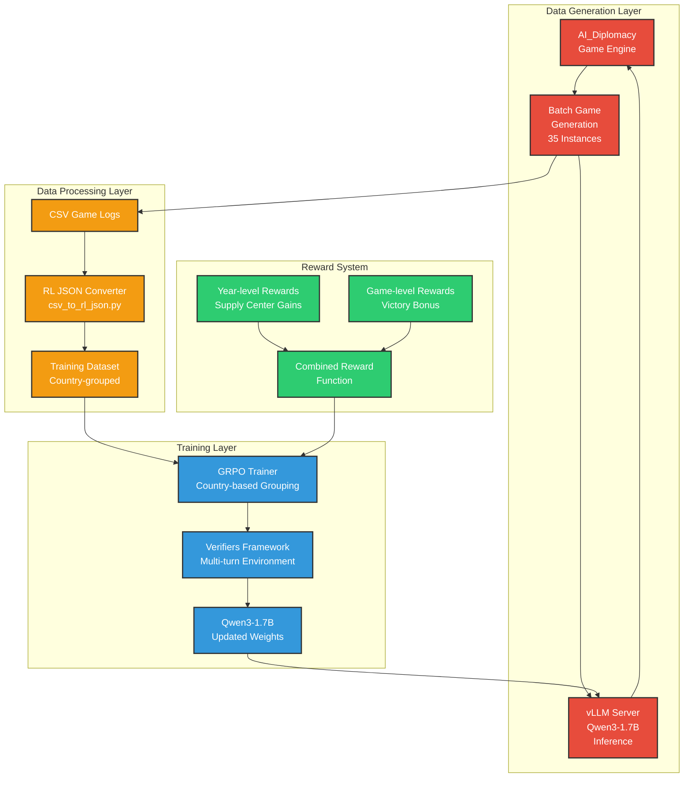

# LLM Self-Play Pipeline with GRPO Implementation Plan

## Executive Summary

This document outlines the implementation plan for a Large Language Model (LLM) self-play pipeline using the Qwen3-1.7B model, vLLM inference, and Group Relative Policy Optimization (GRPO) with Country-Based Grouping for the game of Diplomacy.

## System Architecture Overview



## Component Analysis

### 1. AI_Diplomacy Library Analysis

**Strengths:**
- Complete Diplomacy game implementation with LLM agents
- Rich prompt system with country-specific behaviors  
- Comprehensive logging via `llm_responses.csv`
- Established RL conversion pipeline (`csv_to_rl_json.py`)
- Support for multiple LLM providers including vLLM

**Key Components:**
- `lm_game.py`: Main game orchestrator
- `ai_diplomacy/agent.py`: Stateful agents with memory systems
- `ai_diplomacy/clients.py`: LLM abstraction layer
- `experiments/csv_to_rl_json.py`: Converts game logs to RL format
- `experiments/analyze_rl_json.py`: Analyzes order success/failure

### 2. Verifiers Framework Analysis

**Strengths:**
- Production-ready GRPO implementation built on transformers
- Async multi-turn environment support
- vLLM integration with weight syncing
- Country-based grouping architecture already outlined
- Memory-efficient training pipeline

**Key Components:**
- `verifiers/trainers/grpo_trainer.py`: Core GRPO implementation
- `verifiers/envs/multiturn_env.py`: Multi-turn environment base
- `verifiers/inference/vllm_client.py`: vLLM integration
- `verifiers/trainers/async_batch_generator.py`: Async batch processing

### 3. Country-Based Grouping Strategy

Based on `GRPO_Multi_Agent_Analysis.md`, the key insight is grouping by country rather than prompt:

**Benefits:**
- Natural strategic context preservation
- Balanced opponent exposure across episodes
- Meaningful performance comparisons within countries
- Handles non-stationarity of multi-agent environments

## Implementation Plan

### Phase 1: Environment Integration (Weeks 1-2)

#### 1.1 Create Diplomacy Multi-Turn Environment

```python
# verifiers/envs/diplomacy_env.py
class DiplomacyMultiTurnEnv(MultiTurnEnv):
    """
    Multi-turn environment for Diplomacy gameplay using AI_Diplomacy backend.
    Implements country-based episode generation for GRPO training.
    """
    
    def __init__(self, 
                 dataset: Dataset,
                 system_prompt: str,
                 max_turns: int = 20,
                 countries: List[str] = None,
                 ai_diplomacy_config: Dict = None,
                 **kwargs):
        super().__init__(dataset, system_prompt, **kwargs)
        self.countries = countries or ['Austria', 'England', 'France', 'Germany', 'Italy', 'Russia', 'Turkey']
        self.ai_diplomacy_config = ai_diplomacy_config or {}
        self.max_turns = max_turns
        
    def env_response(self, messages: List[Dict], state: Dict, **kwargs) -> Tuple[Dict, Dict]:
        """
        Process agent response and return game state update.
        Integrates with AI_Diplomacy game engine.
        """
        pass
        
    def is_completed(self, messages: List[Dict], state: Dict, **kwargs) -> bool:
        """
        Determine if game episode is complete.
        Based on game end conditions or max turns reached.
        """
        pass
```

#### 1.2 Implement Country-Based Sampler

```python
# verifiers/trainers/country_sampler.py
class CountryBalancedSampler(Sampler):
    """
    Ensures balanced sampling across countries for GRPO grouping.
    Each batch contains num_generations episodes per country.
    """
    
    def __init__(self, 
                 dataset: Dataset,
                 num_generations_per_country: int = 5,
                 countries: List[str] = None):
        self.countries = countries or ['Austria', 'England', 'France', 'Germany', 'Italy', 'Russia', 'Turkey']
        self.num_generations_per_country = num_generations_per_country
        self.dataset = dataset
        
    def __iter__(self):
        """
        Yield samples ensuring each country gets equal representation
        across the 35 total instances (5 games × 7 countries).
        """
        for country in self.countries:
            country_scenarios = self._get_scenarios_for_country(country)
            for _ in range(self.num_generations_per_country):
                yield random.choice(country_scenarios)
```

#### 1.3 Modified GRPO Trainer for Country Grouping

```python
# verifiers/trainers/diplomacy_grpo_trainer.py
class DiplomacyGRPOTrainer(GRPOTrainer):
    """
    GRPO trainer with country-based advantage computation.
    Implements the strategy outlined in GRPO_Multi_Agent_Analysis.md.
    """
    
    def _compute_advantages(self, rewards: torch.Tensor, countries: torch.Tensor) -> torch.Tensor:
        """
        Compute advantages grouped by country assignment.
        Each country's episodes are compared against other episodes of the same country.
        """
        advantages = torch.zeros_like(rewards)
        
        for country in self.countries:
            country_mask = (countries == country)
            if country_mask.sum() > 0:
                country_rewards = rewards[country_mask]
                country_mean = country_rewards.mean()
                country_advantages = country_rewards - country_mean
                
                if self.scale_rewards:
                    country_std = country_rewards.std()
                    country_advantages = country_advantages / (country_std + 1e-4)
                
                advantages[country_mask] = country_advantages
        
        return advantages
```

### Phase 2: Reward System Implementation (Weeks 2-3)

#### 2.1 Multi-Level Reward Structure

```python
# verifiers/rubrics/diplomacy_rubric.py
class DiplomacyRubric(Rubric):
    """
    Implements year-level and game-level reward structure for Diplomacy.
    Addresses reward sparsity through intermediate feedback.
    """
    
    def __init__(self, 
                 year_reward_weight: float = 1.0,
                 game_reward_weight: float = 10.0,
                 **kwargs):
        self.year_reward_weight = year_reward_weight
        self.game_reward_weight = game_reward_weight
        
        reward_functions = [
            self.compute_year_reward,
            self.compute_game_reward,
            self.compute_order_validity_reward
        ]
        weights = [year_reward_weight, game_reward_weight, 0.1]
        
        super().__init__(reward_functions, weights, **kwargs)
    
    def compute_year_reward(self, prompt: str, completion: str, answer: str, **kwargs) -> float:
        """
        Reward based on supply center gains during the year.
        Provides intermediate feedback to address reward sparsity.
        """
        game_state = kwargs.get('game_state', {})
        country = kwargs.get('country', '')
        
        # Calculate supply center difference from start to end of year
        initial_centers = game_state.get('initial_supply_centers', 0)
        final_centers = game_state.get('final_supply_centers', 0)
        
        # Normalize by country starting position
        country_base_centers = self._get_country_starting_centers(country)
        gain_ratio = (final_centers - initial_centers) / country_base_centers
        
        return gain_ratio
    
    def compute_game_reward(self, prompt: str, completion: str, answer: str, **kwargs) -> float:
        """
        Large reward for winning the entire game.
        """
        game_result = kwargs.get('game_result', 'ongoing')
        country = kwargs.get('country', '')
        
        if game_result == 'victory' and kwargs.get('winner') == country:
            return 1.0
        elif game_result == 'draw':
            return 0.3
        elif game_result == 'defeat':
            return -0.1
        
        return 0.0  # Ongoing game
```

#### 2.2 Integration with AI_Diplomacy Analysis

```python
# pipeline/reward_processor.py
class RewardProcessor:
    """
    Processes AI_Diplomacy game logs to extract reward signals.
    Bridges the gap between game outcomes and RL training data.
    """
    
    def process_game_log(self, game_json_path: str) -> List[Dict]:
        """
        Extract episode data with rewards from AI_Diplomacy game log.
        Returns list of training examples with country-based grouping.
        """
        with open(game_json_path, 'r') as f:
            game_data = json.load(f)
        
        episodes = []
        for phase_data in game_data['phases']:
            for country in self.countries:
                episode = self._extract_country_episode(phase_data, country, game_data)
                if episode:
                    episodes.append(episode)
        
        return episodes
    
    def _extract_country_episode(self, phase_data: Dict, country: str, game_data: Dict) -> Dict:
        """
        Extract single country episode with prompt, completion, and rewards.
        """
        # Extract LLM interactions for this country in this phase
        country_actions = phase_data.get('orders', {}).get(country, [])
        country_messages = phase_data.get('messages', {}).get(country, [])
        
        # Build prompt from game state and context
        prompt = self._build_country_prompt(phase_data, country, game_data)
        
        # Extract completion (orders + diplomatic messages)
        completion = self._build_country_completion(country_actions, country_messages)
        
        # Calculate rewards
        year_reward = self._calculate_year_reward(phase_data, country, game_data)
        game_reward = self._calculate_game_reward(game_data, country)
        
        return {
            'prompt': prompt,
            'completion': completion,
            'country': country,
            'phase': phase_data['name'],
            'year_reward': year_reward,
            'game_reward': game_reward,
            'total_reward': year_reward + game_reward
        }
```

### Phase 3: Batch Generation System (Weeks 3-4)

#### 3.1 Multi-Game Orchestrator

```python
# pipeline/batch_game_generator.py
class BatchGameGenerator:
    """
    Orchestrates 5 concurrent Diplomacy games (35 total instances).
    Manages vLLM inference distribution and game synchronization.
    """
    
    def __init__(self, 
                 vllm_server_host: str = "localhost",
                 vllm_server_port: int = 8000,
                 num_concurrent_games: int = 5,
                 max_year: int = 1910):
        self.vllm_server_host = vllm_server_host
        self.vllm_server_port = vllm_server_port
        self.num_concurrent_games = num_concurrent_games
        self.max_year = max_year
        
        # Initialize AI_Diplomacy game runners
        self.game_runners = [
            self._create_game_runner(game_id=i) 
            for i in range(num_concurrent_games)
        ]
    
    async def generate_batch(self) -> List[str]:
        """
        Generate a complete batch of 5 games concurrently.
        Returns list of game result file paths.
        """
        tasks = []
        for runner in self.game_runners:
            task = asyncio.create_task(runner.run_complete_game())
            tasks.append(task)
        
        # Wait for all games to complete
        results = await asyncio.gather(*tasks)
        
        # Process results and return file paths
        return [result['game_log_path'] for result in results]
    
    def _create_game_runner(self, game_id: int) -> 'GameRunner':
        """
        Create individual game runner with vLLM client configuration.
        """
        return GameRunner(
            game_id=game_id,
            vllm_host=self.vllm_server_host,
            vllm_port=self.vllm_server_port,
            max_year=self.max_year,
            output_dir=f"batch_games/game_{game_id}"
        )
```

#### 3.2 vLLM Integration Layer

```python
# pipeline/vllm_integration.py
class VLLMDiplomacyClient:
    """
    Specialized vLLM client for Diplomacy game generation.
    Handles 35 concurrent inference requests efficiently.
    """
    
    def __init__(self, 
                 host: str = "localhost", 
                 port: int = 8000,
                 max_concurrent: int = 35):
        self.client = openai.OpenAI(
            base_url=f"http://{host}:{port}/v1",
            api_key="EMPTY"
        )
        self.semaphore = asyncio.Semaphore(max_concurrent)
        
    async def generate_country_action(self, 
                                    country: str,
                                    game_state: Dict,
                                    prompt_template: str) -> Dict:
        """
        Generate action for specific country with rate limiting.
        """
        async with self.semaphore:
            prompt = self._build_country_prompt(country, game_state, prompt_template)
            
            response = await self.client.chat.completions.create(
                model="Qwen/Qwen2.5-1.5B-Instruct",  # Adjust to actual model name
                messages=[{"role": "user", "content": prompt}],
                temperature=0.7,
                max_tokens=512
            )
            
            return {
                'country': country,
                'prompt': prompt,
                'completion': response.choices[0].message.content,
                'model': "Qwen2.5-1.5B-Instruct"
            }
```

### Phase 4: Training Pipeline Integration (Weeks 4-5)

#### 4.1 End-to-End Training Script

```python
# train_diplomacy_grpo.py
import asyncio
import verifiers as vf
from pipeline.batch_game_generator import BatchGameGenerator
from pipeline.reward_processor import RewardProcessor
from verifiers.envs.diplomacy_env import DiplomacyMultiTurnEnv
from verifiers.trainers.diplomacy_grpo_trainer import DiplomacyGRPOTrainer

async def main():
    # Initialize components
    model, tokenizer = vf.get_model_and_tokenizer("Qwen/Qwen2.5-1.5B-Instruct")
    
    # Setup batch game generation
    batch_generator = BatchGameGenerator(
        num_concurrent_games=5,
        max_year=1910
    )
    
    # Setup reward processing
    reward_processor = RewardProcessor()
    
    # Training loop
    for epoch in range(100):  # Adjust as needed
        print(f"Starting epoch {epoch + 1}")
        
        # Generate batch of games
        game_logs = await batch_generator.generate_batch()
        
        # Process games into training data
        training_episodes = []
        for log_path in game_logs:
            episodes = reward_processor.process_game_log(log_path)
            training_episodes.extend(episodes)
        
        # Create dataset for this batch
        batch_dataset = Dataset.from_list(training_episodes)
        
        # Setup environment
        diplomacy_env = DiplomacyMultiTurnEnv(
            dataset=batch_dataset,
            system_prompt="You are playing Diplomacy. Make strategic decisions.",
            max_turns=20,
            countries=['Austria', 'England', 'France', 'Germany', 'Italy', 'Russia', 'Turkey']
        )
        
        # Setup trainer
        training_args = vf.grpo_defaults(run_name=f"diplomacy-epoch-{epoch}")
        training_args.num_generations_per_country = 5
        training_args.per_device_train_batch_size = 7  # One per country
        training_args.gradient_accumulation_steps = 1
        
        trainer = DiplomacyGRPOTrainer(
            model=model,
            processing_class=tokenizer,
            env=diplomacy_env,
            args=training_args
        )
        
        # Train on this batch
        trainer.train()
        
        # Save checkpoint
        model.save_pretrained(f"checkpoints/epoch_{epoch}")
        
        print(f"Completed epoch {epoch + 1}")

if __name__ == "__main__":
    asyncio.run(main())
```

#### 4.2 Configuration Management

```python
# config/training_config.py
from dataclasses import dataclass
from typing import List, Dict, Any

@dataclass
class DiplomacyTrainingConfig:
    # Model settings
    model_name: str = "Qwen/Qwen2.5-1.5B-Instruct"
    
    # Game generation settings
    num_concurrent_games: int = 5
    max_year: int = 1910
    num_negotiation_rounds: int = 2
    
    # GRPO settings
    num_generations_per_country: int = 5
    learning_rate: float = 1e-5
    batch_size: int = 7  # One per country
    num_epochs: int = 100
    
    # Reward settings
    year_reward_weight: float = 1.0
    game_reward_weight: float = 10.0
    
    # Infrastructure settings
    vllm_host: str = "localhost"
    vllm_port: int = 8000
    max_concurrent_inference: int = 35
    
    # Output settings
    checkpoint_dir: str = "checkpoints"
    game_logs_dir: str = "batch_games"
    
    def to_dict(self) -> Dict[str, Any]:
        return asdict(self)
```

### Phase 5: Monitoring and Evaluation (Week 5-6)

#### 5.1 Training Metrics Dashboard

```python
# monitoring/training_monitor.py
class DiplomacyTrainingMonitor:
    """
    Monitors training progress with Diplomacy-specific metrics.
    """
    
    def __init__(self, config: DiplomacyTrainingConfig):
        self.config = config
        self.country_performance = defaultdict(list)
        self.epoch_rewards = []
        
    def log_epoch_results(self, epoch: int, training_episodes: List[Dict]):
        """
        Log training results for the epoch.
        """
        # Track performance by country
        for episode in training_episodes:
            country = episode['country']
            total_reward = episode['total_reward']
            self.country_performance[country].append(total_reward)
        
        # Calculate epoch metrics
        epoch_avg_reward = np.mean([ep['total_reward'] for ep in training_episodes])
        self.epoch_rewards.append(epoch_avg_reward)
        
        # Log to wandb
        wandb.log({
            'epoch': epoch,
            'avg_reward': epoch_avg_reward,
            'country_rewards': {
                country: np.mean(rewards[-5:])  # Last 5 episodes
                for country, rewards in self.country_performance.items()
            }
        })
        
    def generate_report(self) -> str:
        """
        Generate comprehensive training report.
        """
        report = f"""
        Diplomacy GRPO Training Report
        =============================
        
        Total Epochs: {len(self.epoch_rewards)}
        Average Reward Trend: {np.mean(self.epoch_rewards[-10:]):.3f}
        
        Country Performance (Last 10 Episodes):
        """
        
        for country in sorted(self.country_performance.keys()):
            recent_performance = np.mean(self.country_performance[country][-10:])
            report += f"\n{country}: {recent_performance:.3f}"
        
        return report
```

#### 5.2 Model Evaluation Framework

```python
# evaluation/diplomacy_evaluator.py
class DiplomacyEvaluator:
    """
    Evaluates trained models against baselines and each other.
    """
    
    def __init__(self, models: Dict[str, Any], baseline_model: str = None):
        self.models = models
        self.baseline_model = baseline_model
        
    async def evaluate_tournament(self, num_games: int = 50) -> Dict[str, Any]:
        """
        Run tournament between different model versions.
        """
        results = {}
        
        for model_name, model in self.models.items():
            model_results = await self._evaluate_model(model, num_games)
            results[model_name] = model_results
            
        return self._compile_tournament_results(results)
    
    async def _evaluate_model(self, model: Any, num_games: int) -> Dict[str, float]:
        """
        Evaluate single model performance.
        """
        wins = 0
        total_supply_centers = 0
        
        for game_id in range(num_games):
            # Run evaluation game
            game_result = await self._run_evaluation_game(model, game_id)
            
            if game_result['winner'] == model.name:
                wins += 1
            
            total_supply_centers += game_result['final_supply_centers']
        
        return {
            'win_rate': wins / num_games,
            'avg_supply_centers': total_supply_centers / num_games,
            'total_games': num_games
        }
```

## Implementation Timeline

### Week 1-2: Foundation
- Set up development environment
- Implement `DiplomacyMultiTurnEnv`
- Create `CountryBalancedSampler`
- Modify GRPO trainer for country grouping

### Week 3-4: Game Generation
- Implement `BatchGameGenerator`
- Set up vLLM server infrastructure  
- Create reward processing pipeline
- Test end-to-end game generation

### Week 4-5: Training Integration
- Implement `DiplomacyGRPOTrainer`
- Create training loop
- Set up checkpointing and logging
- Run initial training experiments

### Week 5-6: Optimization and Evaluation
- Implement monitoring dashboard
- Create evaluation framework
- Optimize hyperparameters
- Run full training pipeline

## Technical Requirements

### Hardware Requirements
- **GPU**: Minimum 4x RTX 4090 or equivalent
  - 2 GPUs for vLLM inference server (tensor parallel)
  - 2 GPUs for GRPO training (data parallel)
- **RAM**: 128GB+ system memory
- **Storage**: 2TB+ NVMe SSD for game logs and checkpoints

### Software Dependencies
- **Python**: 3.10+
- **PyTorch**: 2.1+
- **Transformers**: 4.36+
- **vLLM**: Latest stable
- **Accelerate**: Latest for multi-GPU training

### Infrastructure Setup
```bash
# 1. Install dependencies
pip install -e verifiers[all]
pip install -e AI_Diplomacy
pip install vllm

# 2. Start vLLM server
CUDA_VISIBLE_DEVICES=0,1 vllm serve Qwen/Qwen2.5-1.5B-Instruct \
    --tensor-parallel-size 2 \
    --port 8000 \
    --host 0.0.0.0

# 3. Run training
CUDA_VISIBLE_DEVICES=2,3 accelerate launch \
    --num-processes 2 \
    --config-file configs/zero3.yaml \
    train_diplomacy_grpo.py
```

## Risk Mitigation

### Technical Risks
1. **Memory limitations**: Use gradient checkpointing and batch size tuning
2. **Training instability**: Implement learning rate scheduling and gradient clipping
3. **Inference bottlenecks**: Use async generation and connection pooling

### Research Risks
1. **Reward sparsity**: Multi-level reward structure addresses this
2. **Country imbalance**: Country-specific normalization in advantage computation
3. **Non-stationarity**: Country-based grouping specifically designed to handle this

## Success Metrics

### Training Metrics
- **Convergence**: Stable improvement in average reward over epochs
- **Country Balance**: Similar performance improvement across all countries
- **Order Validity**: Increasing percentage of valid orders generated

### Game Performance Metrics
- **Win Rate**: Improved win rate against baseline models
- **Strategic Depth**: Average game length and supply center progression
- **Diplomatic Skill**: Message coherence and relationship management

## Expected Outcomes

1. **Functional Pipeline**: Complete self-play training system
2. **Improved Model**: Qwen3-1.7B with enhanced Diplomacy capabilities
3. **Research Insights**: Validation of country-based GRPO grouping
4. **Scalable Framework**: Extensible to other multi-agent environments

This implementation plan provides a comprehensive roadmap for building the LLM self-play pipeline with GRPO. The modular design allows for iterative development and testing, while the country-based grouping strategy addresses the unique challenges of multi-agent RL in strategic games like Diplomacy.